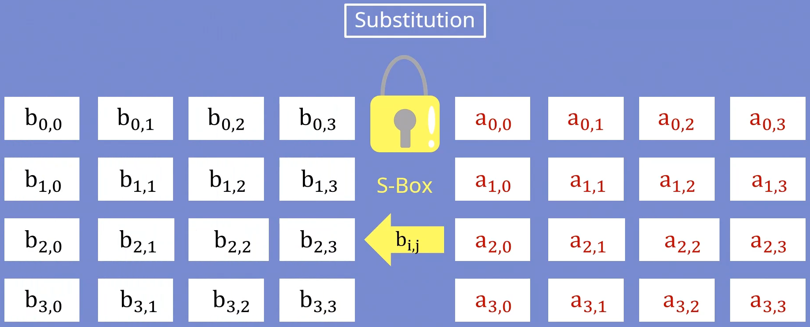
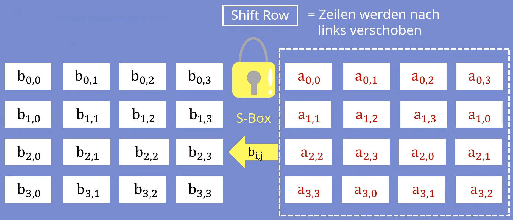
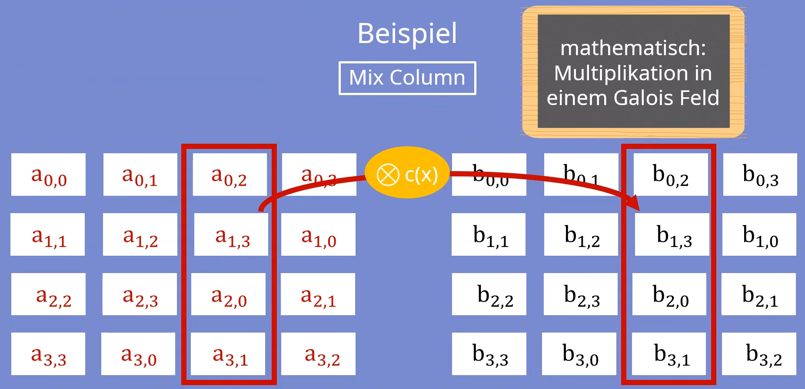
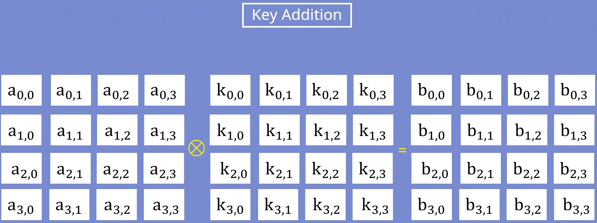
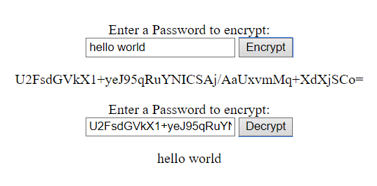

# Anleitung zur Passwortverschlüsselung mit JavaScript
## 1. Voraussetzungen

- Sie kennen sich aus mit Javascript.
- Sie wissen schon wie eine HTML5-Seiten erstellt wird.

## 2. Einführung

Sie denken bestimmt, dass Verschlüsselung ein sehr kompliziertes Thema ist. Sie haben recht. Deshalb werden Sie in dieser Anleitung einen kleinen Überblick bekommen zum Thema Verschlüsselung und Entschlüsselung von Passwörtern. Dafür werden Sie mit JavaScript zwei kleine Funktionen schreiben, eines für die Verschlüsselung und die andere für die Entschlüsselung.

## 3. Verschlüsselung 

### 3.1. Verschlüsselungsbibliothek

In dieser Anleitung werden Sie ihre Passwörter anhand der Bibliothek ``` CryptoJS ``` mit Algorithmen verschlüsselng oder entschlüsseln können. Dafür können Sie in ihre HTML-Seite am Ende vom Body element dieses Skript verlinken, welches die Bibliothek CryptoJS verlinkt.

```html
<script src="https://cdnjs.cloudflare.com/ajax/libs/crypto-js/3.1.9-1/crypto-js.js"></script>
```

>**Info** CryptoJS ist eine wachsende Sammlung von standardmässigen und sicheren Algorithmen, die unter Verwendung von Mustern in JavaScript implementiert sind. Sie sind schnell und haben eine einheitliche und einfache Benutzeroberfläche.

### 3.2. Verschlüsselungsfunktion

Damit wir mit JS ein Passwort verschlüsseln können, benötigen wir eine Funktion welche irgendein Text als Parameter annehmen kann. Denn Text wird mit anhand des AES Algorithmen verschlüsselt. Wir haben dieses Verfahren verwendet, da man zusätlich noch ein **Salt** angeben kann, welches die Verschlüsselung um einiges sicherer macht.

```javascript
function encrypt(password){
  let hashed = CryptoJS.AES.encrypt(password, 'this is a salt');
  console.log(hashed.toString());
}
```

>**Info** Hier haben wir den ``` AES ``` Algorithmus verwendet, welches symmetrisch die Daten verschlüsselt. Ist heute eines der meist verwendeten und sichersten Verfahren.

>**Frage** Was passiert mit dem gehashten, wenn Sie einen anderen Salt verwenden?
> Welche Verschlüsselungsalgorithmen kennen Sie denn noch?


### 3.3 Das AES-Verfahren
Das Verfahren erzeugt als erstes die Rundenschlüssel unter der Verwendung des Eingabgeschlüssels. In der ersten Runde verwendet es dabei den Eingabeschlüssel. Die anderen Schlüssel für die restlichen Runden erhält man hingegen durch Substitution und XOR Verknüpfungen. Insgesamt besteht eine Runde aus vier verschiedenen Schritten:


#### 3.3.1. Substitution
In diesem Schritt wird jedes Byte mithilfe einer Substitutionsbox, sprich S-Box verschlüsselt. Die S-Box gibt dabei eine Regel an, wie ein Byte eines Blockes durch einen anderen Wert zu ersetzen ist. Dadurch werden die Bytes vermischt.


*Abblidung 1: Subtitution*

#### 3.3.2. Shift Row
Nach der Substitution werden nun die Zeilen in der Tabelle um eine bestimmte Anzahl an Spalten nach links verschoben. Die überlaufenden Zellen werden rechts an die jeweilige Zeile wieder angehängt.


*Abblidung 2: Shift Row*

#### 3.3.3. Mix Column
In diesem Schritt geht es um die Vermischung der Spalten. Hierfür wird jede Spalte mit einer bestimmten Matrix multipliziert. Die Bytes werden dabei nicht als Zahlen gesehen, sondern als Polynome. Dies bedeutet, dass die Multiplikation über einem Galois Feld (2^8) durchgeführt wird.


*Abblidung 3: Mix Column*

#### 3.3.4. Key Addition
Hier wird jeder Block mit dem aktuellen Rundenschlüssel XOR verknüpft. Die XOR-Verknüpfung läuft dabei bitweise ab.


*Abblidung 4: Key Addition*

## 4. Entschlüsselungsfunktion

Für die Entschlüsselung brauchen Sie das gehashte Passwort, welchen sie den mithilfe der ```decrypt()``` Funktion entschlüsseln.

```javascript
function decrypt(hashed){
  let decrypted = CryptoJS.AES.decrypt(hashed, 'this is a salt');
  console.log(decrypted.toString(CryptoJS.enc.Utf8));
}
```

>**Tipp:**
>Bei der Entschlüsselung müssen Sie aufpassen, dass Sie den selben Salt verwenden als den bei der Verschlüsselung.


## 5. Beispiel auf einer HTML-Seite

Auf dieser HTML-Seite befindet sich eine Form mit zwei Passwortfeldern und zwei Buttons, einer ist zur Verschlüsselung des Textes und der andere zum entschlüsseln.

```html
<!DOCTYPE html>
<html>
  <head>
    <meta charset="utf-8">
    <meta name="viewport" content="width=device-width">
    <title>JavaScript password encryption</title>
  </head>
  <body>
    <main style="text-align: center;">
      <br>
        <form action="">
          <label for="passwordField">Enter a Password to encrypt:</label>
          <br>
          <input id="passwordField" type="text">
          <input type="button" value="Encrypt" onclick="encrypt()">
          <p id="encryptedPassword"></p>
          <label for="passwordField2">Enter a Password to encrypt:</label>
          <br>
          <input id="passwordField2" type="text">
          <input type="button" value="Decrypt" onclick="decrypt()">
          <p id="decryptedPassword"></p>
        </form>    
    </main>      
    <script src="https://code.jquery.com/jquery-3.6.0.js"></script>
    <script src="https://cdnjs.cloudflare.com/ajax/libs/crypto-js/3.1.9-1/crypto-js.js"></script>
    <script src="script.js"></script>
  </body>
</html>
```

### 5.1. Anpassung

Damit die Funktionen jedoch mit der Seite funktionieren, müssen Sie diese folgendermassen anpassen:

```javascript
function decrypt(){
  let hashed = document.getElementById("passwordField2").value;
  let decrypted = CryptoJS.AES.decrypt(hashed, 'this is a salt');
  console.log(decrypted.toString(CryptoJS.enc.Utf8));
  $('#decryptedPassword').html(decrypted.toString(CryptoJS.enc.Utf8));
}

function encrypt(){
  let password = document.getElementById("passwordField").value;
  let hashed = CryptoJS.AES.encrypt(password, 'this is a salt');
  console.log(hashed.toString());
  $('#encryptedPassword').html(hashed.toString());
  decrypt(hashed);
}
```

### 5.2. Seitenbeispiel

Wenn Sie Ihre Seite jetzt öffnen, müsste diese sich diesem Beispiel ähneln:



*Abblidung 5: HTML-Seite Beispiel*

## 6. Konklusion

In dieser Anleitung, konnten Sie sich einen kleinen Überblick zur Verschlüsselung mit JavaScript schaffen. Sie können jetzt wenn Sie wollen mithilfe der [CryptoJS Dokumentation](https://cryptojs.gitbook.io/docs/) verschiedene Verschlüsselungsmethoden ausprobieren. Für Probleme können Sie jederzeit den vollständigen [Source-Code auf Github](https://github.com/EMbztf/JavaScript-password-encryption) untersuchen.

## 7. Glossar

| Begriff | Definition |
| --- | --- |
| AES-Encryption | Abkürzung für Advanced Encryption Standard. AES verwendet das symmetrische Verschlüsselungsverfahren verschlüsselt. Dies bedeutet, dass es im Gegensatz zur asymmetrischen Verschlüsselung nur einen Schlüssel zum Verschlüsseln und zum Entschlüsseln gibt. AES gilt heute immer noch als nicht knackbar. |
| Salt | Salt ist eine Möglichkeit, Kennwörter noch sicherer zu machen, indem man zu einem Kennwort eine zufällige Zeichenkette hinzufügt, bevor es vom Algorithmus verschlüsselt wird. Je länger diese zufällige Zeichenkette ist, desto schwieriger wird die Entschlüsselung, desto sicherer sind die Kennwörter. |

## 8. Abbildungsverzeichnis

| Abbildung | Beschreibung |
| --- | --- |
| Abbildung 1. Subtitution | Beispiel des ersten Schrittes der AES-Verschlüsselung, die Substitution.|
| Abbildung 2. Shift Row | Beispiel des zweiten Schrittes der AES-Verschlüsselung, das Shift Row. |
| Abbildung 3. Mix Column | Beispiel des dritten Schrittes der AES-Verschlüsselung, das Mix Column. |
| Abbildung 4. Key Addition| Beispiel des vierten Schrittes der AES-Verschlüsselung, die Key Addition. |
| Abbildung 5. HTML-Seite Beispiel| Beispiel einer HTML-Seite, welches die Verschlüsselung verwendet. |


